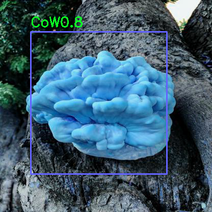

# Segmentação e Detecção de objetos com CNN
Implementação de segmentação e detecção de objetos com CNN

## Conteúdo
Este repositório contém uma implementação de segmentação semântica (Unet + mobilinet) para parafusos e um modelo de detecção de objetos (YOLOv4) para cogumelos. Os pesos estão disponíveis neste [link](https://drive.google.com/drive/folders/1ChtI9I-5SVqF6m0g9xwo6jp6fp71C7Yh?usp=sharing).


# Modelo de Segmentação semantica

para segmentação semântica crie um ambiente anaconda

```bash
conda create -n myenv python=3.9
conda activate myenv
```
### Requerimentos e bibliotecas 

Requerimentos de instalação 

```bash
conda install -c fastai -c pytorch -c anaconda -c conda-forge fastai gh anaconda
conda install -c fastai fastai
conda install -c conda-forge imutils
conda install -c conda-forge opencv
```


## Métricas do Modelo de segmentação (Unet)
Foram usadas a metrica IoU (Intersection over union) para avaliar o modelo de segmentação.

| Modelo        | IoU (%) | 
| ------------- |-----:|
| Unet - mobilinet         |72.1|


## Inferência 
Para realizar a inferência do modelo de segmentação pré-treinado no conjunto de teste , execute:

```bash
!python main_detection.py \
 --weight_folder "your_path/files_yolov4/" \
 --path_rgb_image "your_path/img_rgb_detection/" \
 --res_dir "your_path/results_object_detection"
```

## Resultados qualitativos da segmentação de parafusos
<p align="center">
  
</p>


# Modelo de Detecção de objetos

## Métricas do Modelo de Detecção (YOLOv4 - Darknet)
Foram usadas as mtricas de Coco para avaliar o modelo de detecção.

| Modelo - YOLOv4        | TP            | FP             | mAP (%) | 
| ------------- |:-------------:| :-------------:|-----:|
| Cantarelo        | 60            | 54             |70|
| CoW        | 60            | 54             |70|


## Inferência 
Para realizar a inferência do modelo de detecção pré-treinado no conjunto de teste , execute:

```bash
!python main_detection.py \
 --weight_folder "your_path/files_yolov4/" \
 --path_rgb_image "your_path/img_rgb_detection/" \
 --res_dir "your_path/results_object_detection"
```

## Resultados qualitativos da detecção de cogumelos
<p align="center">
  
</p>


