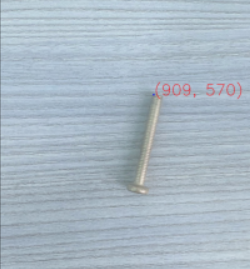

# Segmentação de objetos com HSV e Detecção de objetos com CNN
Implementação de segmentação de parafuso com técnicas clássicas de processamento de imagem HSV e detecção de congumelos com CNN. 

Para visualizar o código passo a passo e os resultados dos algoritmos propostos, é recomendável abrir **Visuailisations_object_detection.ipynb**  e **Visuailisations_object_segmentation_HSV.ipynb** 

## Conteúdo
Este repositório contém uma implementação de segmentação de parafuso com técnicas clássicas de processamento de imagem HSV  e um modelo de detecção de objetos (YOLOv4) para cogumelos. Os pesos estão disponíveis neste [link](https://drive.google.com/drive/folders/1ChtI9I-5SVqF6m0g9xwo6jp6fp71C7Yh?usp=sharing).

# Segmentação de parafuso com HSV

Para segmentação de parafuso crie um ambiente anaconda

```bash
conda create -n myenv python=3.9
conda activate myenv
```
### Requerimentos e bibliotecas 

Requerimentos de instalação 

```bash
conda install -c conda-forge opencv
conda install -c conda-forge matplotlib
conda install -c anaconda numpy
```

## Inferência 
Para executar o algoritmo use o arquivo:

```bash
Visuailisations_object_segmentation_HSV.ipynb
```


### Resultados qualitativos da coordenada do pixel mais alto do objeto segmentado
<p align="center">
  
</p>

<p align="center">
  
</p>


# Modelo de Detecção de objetos

Para detecção de objetos crie um ambiente anaconda

```bash
conda create -n myenv python=3.9
conda activate myenv
```
### Requerimentos e bibliotecas 

Requerimentos de instalação 

```bash
conda install -c conda-forge opencv
conda install -c conda-forge matplotlib
```


## Métricas do Modelo de Detecção (YOLOv4 - Darknet)
Foram usadas as metricas de Coco para avaliar o modelo de detecção. O modelo atingiu um mAP de 100% devido ao pequeno conjunto de testes, composto por 5 imagens. Sugere-se aumentar os conjuntos de treinamento, validação e teste.

| Modelo - YOLOv4        | TP            | FP             | mAP (%) | 
| ------------- |:-------------:| :-------------:|-----:|
| Cantarelo        | 5            | 0             |100|
| CoW        | 9            | 0             |100|


## Inferência 
Para realizar a inferência do modelo de detecção pré-treinado no conjunto de teste , execute:

```bash
!python main_detection.py \
 --weight_folder "your_path/files_yolov4/" \
 --path_rgb_image "your_path/img_rgb_detection/" \
 --res_dir "your_path/results_object_detection"
```

## Resultados qualitativos da detecção de cogumelos
<p align="center">
  
</p>


# Experimentos adicionais
Um experimento adicional foi realizado para segmentação de parafusos usando CNN. Abaixo alguns resultados

## Modelo de Segmentação semantica CNN

segmentação semântica (Unet + mobilinet) para parafusos
Para segmentação semântica crie um ambiente anaconda

```bash
conda create -n myenv python=3.9
conda activate myenv
```
### Requerimentos e bibliotecas 

Requerimentos de instalação 

```bash
conda install -c fastai -c pytorch -c anaconda -c conda-forge fastai gh anaconda
conda install -c fastai fastai
conda install -c conda-forge imutils
conda install -c conda-forge opencv
```


## Métricas do Modelo de segmentação (Unet)
Foram usadas a metrica IoU (Intersection over union) para avaliar o modelo de segmentação.

| Modelo        | IoU (%) | 
| ------------- |-----:|
| Unet - mobilinet         |74.1|


## Inferência 
Para realizar a inferência do modelo de segmentação pré-treinado no conjunto de teste , execute:

```bash
!python main_segmentation.py \
 --files_unet "your_path/files_unet/" \
 --res_dir "your_path/results_object_segmentation/"
```
## Resultados qualitativos da segmentação de parafusos
<p align="center">
  
</p>

## Resultados qualitativos da coordenada do pixel mais alto do objeto segmentado

É importante dizer que as imagens de entrada para o modelo foram redimensionadas

<p align="center">
  
</p>

<p align="center">
  
</p>

<p align="center">
  
</p>


**Na pasta scripts_train_models_colab encontra-se os arquivos .ipynb para o treinamento dos modelos de segmentação e detecção de objetos executados na plataforma [google colab](https://colab.research.google.com/).**


